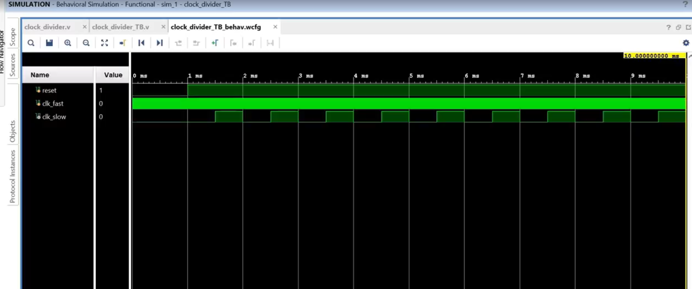

# ⏰ Clock Divider in Verilog

This project implements a clock frequency divider in Verilog. A clock divider takes a high-frequency clock signal as input and outputs a slower clock signal based on a specified ratio.

---

## 📜 Overview

The goal of this challenge is to design and test a Verilog module for a clock frequency divider. 

### Specifications:
- **Inputs**:
  - `clk_in` (fast clock signal).
  - `reset` (active-low reset signal).
  - `ratio` (32-bit input specifying the division ratio).
- **Output**:
  - `clk_out` (slower clock signal based on the ratio).
- **Implementation**:
  - The module counts clock cycles and toggles the output clock (`clk_out`) based on the division ratio.
  - Reset logic ensures the internal registers initialize when the reset line is low.

### Example:
For an input frequency of 100 MHz and a desired output of 1 kHz, the ratio should be `100,000`.

---

## 🚀 How to Run the Code

### Requirements:
- Vivado or any other Verilog simulation tool.

### Steps:
1. Create a new project in the simulation tool.
2. Add the `clock_divider` module and the testbench files.
3. Configure the clock frequency and ratio in the testbench.
4. Run the simulation and observe the results in the waveform viewer.

---

## 📁 Code Files

### Clock Divider Module
The `clock_divider` module uses a 32-bit counter to divide the input clock frequency. The output toggles at half the ratio and resets after completing the full ratio.

### Testbench Module
The testbench verifies the functionality of the `clock_divider` module with different ratios.

## 📝 Example Output
The testbench evaluates the functionality of the clock divider with a 100 MHz input clock and the following configurations:

### Input:
- Clock Input Frequency: 
    1. 100 MHz (10 ns period).
    2. Division Ratio: 100,000.
- Expected Output:
    1. Clock Output Frequency: 1 kHz (1 ms period).
### Results:
- The slower clock `(clk_out)` starts toggling at the expected frequency after releasing the reset line.
- Debugging messages in the testbench `($display)` confirm correct counter behavior.

## Waveform Preview

## 🌟 Key Learnings
- Designing a clock divider with counters and always blocks in Verilog.
- Using reset logic to initialize registers in hardware designs.
- Testing Verilog modules with different configurations and verifying behavior using simulation tools.
